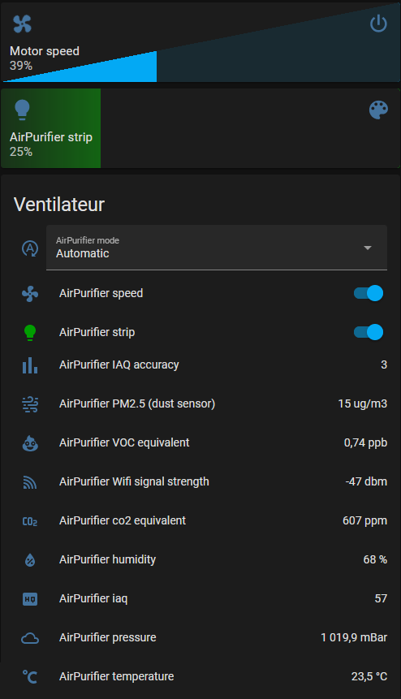

# Code pour Purificateur d'air (Wemos-s2, Wemos-c3, Wemos D1-32)

Pour purificateur d'air fait maison, idée originale des frères Poulain
https://www.youtube.com/watch?v=WbyZMVf7Pek

Modifiée pour un style rond et moins "mastoc".

Ajout d'électronique pour le domotiser avec un mode automatique et ainsi qu'un mode fonctionnant avec HomeAssistant (ou tout autre domotique mqtt)
L'electronique permet de piloter/moduler également la vitesse du moteur.

 

## Liens des composants:
 - Filtre charbon : https://amzn.to/3bw7p8R
 - Filtre HEPA 13 : https://amzn.to/3HPSuT1
 - Turbine Variable : https://amzn.to/3yemHH5
 - Tissu 3D : https://lfp.yt/tissu
 - Contreplaqué
 - Tiges filletés M6
 - Ecrou
 - Rondelles

## Libraries utilisées:
- Bsec 2 (avec l'ajout du support des esp32-s2 et esp32-c3)
- MCP40xx [https://github.com/dzalf/MCP40xx_Digital_Potentiometer]
- home assistant integration (My Fork for Light support and Fan icon)[https://github.com/Tank86/arduino-home-assistant]
- FastLed
 
## Capteurs:
- Capteur de particules : https://global.sharp/products/device/lineup/data/pdf/datasheet/gp2y1010au_appl_e.pdf
- Capteur de qualité de l'air: https://www.adafruit.com/product/3660
- Led WS2818: https://www.adafruit.com/product/1138

## Valeurs remontées
Les valeurs sont remontée toutes les 5 minutes afin de ne pas noyer la communication mqtt.

- Temperature (°C)
- Humidité  (%)
- Pression atmosphérique (mBar)
- co2 equivalent (ppm)
- IAQ (Indice de qualité de l'air)
- IAQ Accuracy
- Breath VOC (composé organic volatile) (ppb)
- PM 2.5 (dust sensor) (µg/m3)

## Mode automatique/Manuel
Le code démarre par defaut avec le mode automatique d'activée, la régulation se fait en fonction des valeurs de PM2.5 et d'IAQ
Le mode automatique est désactivable via un topic MQTT.

## Topics MQTT

 - LedStrip    => homeassistant/light/'MACADDRESS'/
 - Motor       => homeassistant/fan/'MACADDRESS'/
 - AutoMode    => homeassistant/select/'MACADDRESS'/
 - All sensors => homeassistant/sensor/'MACADDRESS'/
 - data/command => aha/'MACADDRESS'/

| Topic                       |   Commande         |  Status               | Format                |
|-----------------------------|:------------------:|:---------------------:|:---------------------:|
| Mode config                 |  N/A               |   mode/config         |   Homeassistant json  |
| Mode value                  | mode/cmd_t         |   mode/stat_t         |   'Automatic' / 'Off' / 'Night' / 'Manual' / 'AutoLed'   |
| LedStrip config             |  N/A               |   ledStrip/config     |   Homeassistant json  |
| LedStrip ON/OFF             | ledStrip/cmd_t     |   ledStrip/stat_t    |   'ON'/'OFF'          |
| LedStrip brightness         | ledStrip/bri_cmd_t |   ledStrip/bri_stat_t |   '1' <> '255'        |
| LedStrip color              | ledStrip/rgb_cmd_t |   ledStrip/rgb_stat_t |   r,g,b(decimal) or #RRGGBB(hexa)|
| Motor config                |  N/A               |   motor/config        |   Homeassistant json  |
| Motor ON/OFF                | motor/cmd_t        |   motor/stat_t        |   'ON'/'OFF'          |
| Motor speed                 | motor/pct_cmd_t    |   motor/pct_stat_t    |   '1' <> '100'        |
| temperature config          | N/A                |   temperature/config  |   Homeassistant json  |
| temperature value           | N/A                |   temperature/stat_t  |   float string        |
| humidity config             | N/A                |   humidity/config     |   Homeassistant json  |
| humidity value              | N/A                |   humidity/stat_t     |   float string        |
| pressure config             | N/A                |   pressure/config     |   Homeassistant json  |
| pressure value              | N/A                |   pressure/stat_t     |   float string        |
| co2_equivalent config       | N/A                |   co2_equivalent/config  |   Homeassistant json  |
| co2_equivalent value        | N/A                |   co2_equivalent/stat_t   |   float string       |
| iaq config                  | N/A                |   iaq/config          |   Homeassistant json  |
| iaq value                   | N/A                |   iaq/stat_t          |   float string        |
| iaqAccuracy config          | N/A                |   iaqAccuracy/config  |   Homeassistant json  |
| iaqAccuracy value           | N/A                |   iaqAccuracy/stat_t  |   float string        |
| vocEquivalent config        | N/A                |   vocEquivalent/config  |   Homeassistant json  |
| vocEquivalent value         | N/A                |   vocEquivalent/stat_t  |   float string        |
| pm25 config                 | N/A                |   pm25/config         |   Homeassistant json  |
| pm25 value                  | N/A                |   pm25/stat_t         |   float string        |
| wifi rssi config            | N/A                |   wrssi/config        |   Homeassistant json  |
| wifi rssi value             | N/A                |   wrssi/stat_t        |   float string        |

## Homeassistant
Le soft va fournir toutes les configuration nécéssaire a homeassistant (icone, unité, nom, plage d'ajustement).
Il va aussi s'authentifer automatiquement et apparaitre sous la forme d'une novuelle entitée "air-manager".

 
 
 

Note: Pour avoir ces cartes customisées j'ai utilisées les custom cards 
- custom:slider-button-card
- custom:bar-card

Voir : [Fan Speed](doc/AirControlSpeedCard.yml)  [Led strip color](doc/AirControlColorCard.yml)  [Quality cards](doc/AirQualityCards.yml) 

## Jeedom
Le soft est construit avec une librarie HomeAssistant, cependant les topics MQTT sont accessibles à tout autre soft domotique notament JEEDOM.

Et ca ressemble a ca si vous utilisez le template suivant  => [Template](doc/JeedomTemplate_Air_Purificator.json)

 

## TODO
- Sauvegarder le mode auto dans l'eeprom
- Ajouter hysteresis pour l'activation du moteur (et eviter qu'il s'allume et s'eteigne trop rapidement)

## PCB:

 

*Note: Send me message if you are interested on a PCB.*
